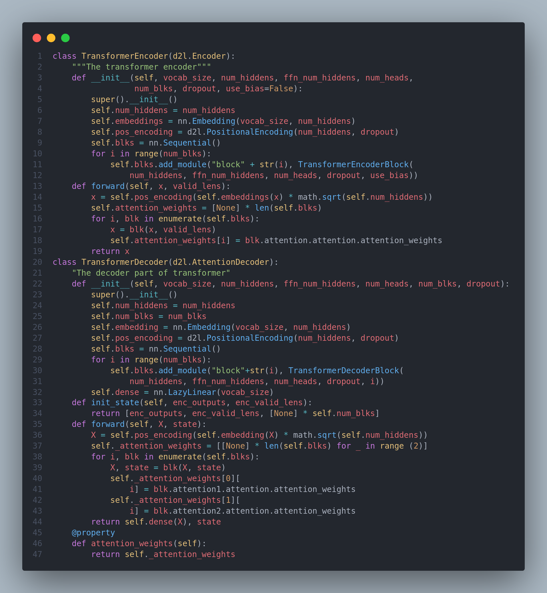

# 100 Days of Deep Learning

🚀 Hello everyone, I'm excited to share that I'm diving into #100DaysOfDeepLearning to strengthen my foundations as well as help others who are wondering where to, how to start their Deep Learning journey.

💬 I will be starting this journey from the basics of DL so that any one with minimum knowledge regarding machine learning can follow. So, I will start with the famous Andrew NG's Deep Learning Specialization Course along with the book Deep Learning for Coders with Fastai and PyTorch.

*Note: I have studied about these topics in detail but obviously, it is not feasible to include all the things I learnt here. So, I hope that you will also learn these things from the course and the book yourself thoroughly.*

💡 If you want to join this amazing world of machine learning and deep learning, but don't know how, you can check out this amazing medium blog by [**Aleksa Gordić**](https://gordicaleksa.medium.com/get-started-with-ai-and-machine-learning-in-3-months-5236d5e0f230)

## Resources
- [**Deep Learning Specialization**](https://www.coursera.org/specializations/deep-learning)

## Books
- [**Deep Learning for Coders with Fastai and PyTorch**](https://www.amazon.com/_/dp/1492045527?smid=ATVPDKIKX0DER&_encoding=UTF8&tag=oreilly20-20)
- [**Dive into Deep Learning**](https://d2l.ai/)

## Projects and Notebooks
1. [**Dive Into Deep Learning**](https://github.com/drishyakarki/Dive-into-Deep-Learning)
-------

## Day 1

Starting our #Day1 of #100DaysOfDeepLearning, here are the few things I learned today from the course:

- Neural Network: Basically an architecture which consists of nodes(or neurons), layers and weights. Basically, input nodes receive information, hidden layers process it, and output nodes produce the final result.

- Then I learned about supervised learning with neural network, their applications. There are: (a)Structured Data - eg: Housing Data (b)Unstructured data - eg: text, audio, image.

- Later in the course, Andrew explains about why deep learning is being popular more and more. He uses the following graph to illustrate it.

- He talks about how there are more data, more better computational hardware and  better research algorithm which will all contribute in significant amount of advancements in Deep Learning field for a long time in future too.

**Resources**
- [**Deep Learning Specialization**](https://www.coursera.org/specializations/deep-learning)

## Day 2

Continuing the day 2 of my 100DaysOfDeepLearning, today I learned about binary classification and how to apply logistic regression for the binary classification. I learned about the need of sigmoid function, how to learn weight and biases for accurate predictions. Furthermore, I learned about loss function and cost function of logistic regression - the main difference between them. I have posted a short summary of the things I learned in the linkedin and also the python implementation. You can check it out [**here**](https://www.linkedin.com/posts/drishya-karki_day2-activity-7130925730271547392-KOjz?utm_source=share&utm_medium=member_android) I hope you will also give your time to study about these topics following the Deep Learning Specialization course. Looking forward to the days ahead! [**Deep Learning Specialization**](https://www.coursera.org/specializations/deep-learning).

**Resources**
- [**Deep Learning Specialization**](https://www.coursera.org/specializations/deep-learning)

## Day 3

On the third day of #100daysofdeeplearning, today I learned about gradient descent, how it is derived and also implemented logistic regression gradient descent in python. I also learned about computation graph and derivatives with computation graph.I have posted a short summary of the things I learned in the linkedin. You can check it out [**here**](https://www.linkedin.com/posts/drishya-karki_day3-activity-7131293446408966144-9P_I?utm_source=share&utm_medium=member_desktop). I hope you will also spend some time to study about these topics following the [**Deep Learning Specialization**](https://www.coursera.org/specializations/deep-learning) course. Looking forward to the days ahead! 

**Resources**
- [**Deep Learning Specialization**](https://www.coursera.org/specializations/deep-learning)

## Day 4

Today I learned about vectorization - an important technique which helps in performing operations quite faster rather than the typical **for loops**. It enables parallelization on both CPU and GPU. I learned about its importance, how it can help in reducing computational cost and make it more efficient, implemented it for forward propagation as well as backward propagation of logistic regression. It is recommended to implement vectorization rather than explicit for loops whenever possible. It introduces SIMD(Single Instruction Multiple Data). Below are the python implementation of the things I learned. Excited for the coming days! Happy Learning :)

**Basic Implementation showing the difference between the computation of vectorized and non-vectorized approach**

**In Logistic Regression**

**Resources**
- [**Deep Learning Specialization**](https://www.coursera.org/specializations/deep-learning)

## Day 5

**Broadcasting** is a very important concept to understand in numpy which is very useful for performing mathematical operations between arrays of different shapes. Continuing my journey on the 5th day, I learned about broadcasting and its role, common steps for preprocessing a new dataset, how to build parts of your algorithms, helper functions, forward and backward propagation along with optimization. Below is the python implementation of the things I learned. I have also started learning from the book [**Dive into Deep Learning**](https://d2l.ai/). Excited for the coming days! Happy Learning :)

**Resources**
- [**Deep Learning Specialization**](https://www.coursera.org/specializations/deep-learning)
- [**Broadcasting in Numpy**](https://numpy.org/doc/stable/user/basics.broadcasting.html)

## Day 6

🚀 Activation functions are mathematical operations applied to the output of the neuron in neural network which introduces non-linearities to the network. It enables a network to learn complex patterns and relationships in the data. 
On the Day-6 of #100DaysOfDeepLearning, today I learned about various activation functions - sigmoid, tanh, ReLU, leaky ReLU and the intuition behind them.I also studied about the gradient descent for neural network, cost function and random initilaization of the neural network. From the book D2L, I learned about object oriented design for implementation. At a high level, we wish to have three classes: 
(i) Module 
(ii) DataModule
(iii) Trainer 
Hope you will also spend some time to study about these topics following the Deep Learning Specialization course and Dive into Deep Learning book. Looking forward to the days ahead! Happy Learning :)

**Object Oriented Design Implementation**

**Sin-Cos plot with different smoothness**

**Resources**
- [**Deep Learning Specialization**](https://www.coursera.org/specializations/deep-learning)
- [**Dive into Deep Learning**](https://d2l.ai/)

## Day 7

Today I learned about deep l-layer neural network, forward and backward propagation on deep network, how to get your dimensions right, building blocks of DNN and about the parameters and hyperparameters from **Deep Learning Specialization**. From the book **Dive into Deep Learning** I read about different concepts such as model complexity, underfitting or overfitting, polynomial curve fitting, cross-validation, loading the dataset, reading the minibatch, softmax, cross-entropy loss. Below is just the snapshot of the implementation of softmax regression from scratch and also the concise implentation of softmax regression along with the visualization of fashionMNIST. You can checkout the notebooks for the full implementation.

**Resources**
- [**Deep Learning Specialization**](https://www.coursera.org/specializations/deep-learning)
- [**Dive into Deep Learning**](https://d2l.ai/)
- [**ImageClassificationDataset**](https://github.com/drishyakarki/Dive-into-Deep-Learning/blob/main/imageClassificationDataset.ipynb)
- [**Softmax Regression**](https://github.com/drishyakarki/Dive-into-Deep-Learning/blob/main/softmaxRegression.ipynb)

## Day 8

A Multi-Layer Perceptron is a type of artificial neural network that consists of multiple layers of nodes, or neurons, organized in a series of interconnected layers. It is a feedforward neural network.On the Day-8 of #100daysofdeeplearning, today I learned about setting up ML Application, train/dev/test sets, bias and variance, the basic "recipe" for machine learning. I also studied about the bias-variance tradeoff, regularization. Also, from the book D2L, I studied about MLPs, universal approximators.
Below is the snapshot of the python implementation of the MLPs- you can checkout the full notebooks in the github repo below. I hope you will also spend some time dwelling on these topics from the book and the specialization course itself. Happy Learning :)

**Resources**
- [**Deep Learning Specialization**](https://www.coursera.org/specializations/deep-learning)
- [**Dive into Deep Learning**](https://d2l.ai/)
- [**Implementation of MultiLayer-Perceptron**](https://github.com/drishyakarki/Dive-into-Deep-Learning/blob/main/mlpImplementation.ipynb)

## Day 9

On the ninth day of #100daysofdeeplearning, today I learned about various topics such as regualarization, how it helps in reducing variance and preventing overfitting, different regularization techniques - L1 regularization, L2 regularization, dropout, weight decay(sometimes L2-Reg is also called weight decay) and data augmentation from the [**Deep Learning Specialization**](https://www.coursera.org/specializations/deep-learning). Similarly, I learned about vanishing gradients, exploding gradients, visualized them; numerical stability and the need for correct parameter initialization, early stopping, implemented dropout and also predicted housing prices on kaggle: data preprocessing, error measure, k-fold cross validation, weight decay. 
Below is the snapshot of the code- you can checkout the full notebooks by visiting the links below. I hope you will also spend some time dwelling on these topics from the book and the specialization course itself. Happy Learning :)

**Resources**
- [**Deep Learning Specialization**](https://www.coursera.org/specializations/deep-learning)
- [**Dive into Deep Learning**](https://d2l.ai/)
- [**Predicting House Prices**](https://github.com/drishyakarki/Dive-into-Deep-Learning/blob/main/kaggleHousePrediction.ipynb)

## Day 10

On the Day-10 of #100daysofdeeplearning, I learned about numerical approximations of gradients, gradient checking, understanding mini-batch gradient descent, various optimization algorithms such as exponentially weighted average,bias correction, gradient descent with momentum, RMSProp and the combination of these two Adam Optimization algorithm from the [**Deep Learning Specialization**](https://www.coursera.org/specializations/deep-learning). Similarly, I read and implemented different topics from the book [**Dive into Deep Learning**](https://d2l.ai/)(chapter: **Builder's Guide**) relating to construction of custom models, creating custom layers and modules, parameter management, accessing the targeted parameters, tied parameters, layers with and without parameters, reading and writing tensors to file and gpu usage.
Below is just the some part of the code from all the notebooks- you can checkout the full notebook implementation in the github repo. I hope you will also spend some time dwelling on these topics from the book and the specialization course itself. Happy Learning :)

**Resources**
- [**Deep Learning Specialization**](https://www.coursera.org/specializations/deep-learning)
- [**Dive into Deep Learning**](https://d2l.ai/)
- [**Builder's Guide**](https://github.com/drishyakarki/Dive-into-Deep-Learning/tree/main/buildersGuide)

## Day 11

On the Day-11 of #100daysofdeeplearning, I learned about various topics relating to Convolutional Neural Networks such as translation invariance, locality, convolution, feature map, receptive layers, padding and strides, batch normalization, LeNet architecture. I also studied and implemented different modern CNN architectures: AlexNet, VGG, Network in Network, googleNet, ResNet, DenseNet, RegNet.
Below is the architecture of LeNet and ResNet from all the notebooks- you can checkout the full notebook for the implementation of other networks in the github repo. I have two seperate folders, one for CNN in low level from scratch, and other, with the modern CNNs architecture I hope you will also spend some time dwelling on these topics from the book Dive into Deep Learning.Happy Learning :)

**Resources**
- [**Dive into Deep Learning**](https://d2l.ai/)

**Notebooks**
- [**CNN**](https://github.com/drishyakarki/Dive-into-Deep-Learning/tree/main/cnn)
- [**Modern CNN**](https://github.com/drishyakarki/Dive-into-Deep-Learning/tree/main/modernCNN)

## Day 12

On the Day-12 of #100daysofdeeplearning, I learned about sequence models, vocabulary, recurrent neural network: forward propagation and backward propagation through time, different types of RNN, language model and sequence generation, autoregressive models, markov models, the order of decoding, converting raw text into sequence data, tokenization, exploratory language statistics, zipf's law, unigram, bigram and trigram.
Below is the snapshot of the code- you can checkout the full notebook for the implementation of other networks in the github repo.I hope you will also spend some time dwelling on these topics from the book Dive into Deep Learning.Happy Learning :)

**Resources**
- [**Dive into Deep Learning**](https://d2l.ai/)
- [**Deep Learning Specialization**](https://www.coursera.org/specializations/deep-learning)

**Notebooks**
- [**Sequence models**](https://github.com/drishyakarki/Dive-into-Deep-Learning/tree/main/RNN)

## Day 13

Today I learned about language models, sequence generation, vanishing gradients with RNN, exploding gradients with RNN, word embeddings, laplace smoothing, perpelxity, RNN. I also learned and implemented RNN from scratch along with gradient clipping, one hot encoding and decoding. 
Here is the snapshot of the code. I have uploaded the full implementation notebook in the github, you can check it out if you like. Hope you will also spend some time reading about these topics. Keep Learning :)

**Resources**
- [**Dive into Deep Learning**](https://d2l.ai/)
- [**Deep Learning Specialization**](https://www.coursera.org/specializations/deep-learning)

**Notebooks**
- [**RNN from scratch**](https://github.com/drishyakarki/Dive-into-Deep-Learning/tree/main/RNN)

## Day 14

Our from-scratch implementations was designed to provide insight into how each components work. But for writing production code and using RNNs every day, we will want to rely more on libraries that provide us efficiency in both implentation time as well as computation time. Today, on the day 14th of #100daysofdeeplearning, I learned and implemented RNNs concisely by high-level APIs on the Time Machine Dataset.
Here is the snapshot of the code. You can check out the results and predictions in the github repo itself. Hope you will also spend some time reading about these topics. Keep Learning :)

**Resources**
- [**Dive into Deep Learning**](https://d2l.ai/)

**Notebooks**
- [**Concise Implementation of RNN**](https://github.com/drishyakarki/Dive-into-Deep-Learning/tree/main/RNN)

## Day 15

Shortly after the first RNNs were trained using backpropagation, the problems of learning long-term dependencies(vanishing and exploding gradients) became noticeable. Gradient Clipping helped with exploding gradients but addressing vanishing gradients required more elaborate solutions. One of the first and most successful techniques for addressing vanishing gradients came in the form of LSTM(Long short-term memory) model. They have three types of gates: input, forget and output gates that control the flow of information. Later as LSTM architecture gained popularity, number of researchers experimented with it to simplify the architecture. As a result of such initiative, Gated Recurrent Units(GRUs) were introduced which often achieves comparable performance as that of LSTMs but with the advantage of faster computation. Here, the LSTMs gates are replaced by two gates: reset and update gates. Also, deep RNNs were introduced which involved stacking multiple layers of RNNs to create a deep architecture. We often constuct RNNs that are deep not only in the time direction but also in the input-to-output direction.
Below is the snapshot of concise implementation of some of the RNNs architectures such as LSTMs, GRUs, Deep RNNs. You can check out the from-scratch implementation and the predictions in the notebook. Hope you will also spend some time learning about these topics from the book [**Dive into Deep Learning**](https://d2l.ai/) itself. Keep Learning :)

**Resources**
- [**Dive into Deep Learning**](https://d2l.ai/)

**Notebooks**
- [**Some Modern RNNs architecture**](https://github.com/drishyakarki/Dive-into-Deep-Learning/blob/main/RNN/modernRNNArchitecture.ipynb)

## Day 16

As modern RNNs gain popularity, one of the major breakthroughs was in the applied field of statistical machine translation. Here, the model is presented with a sentence in one language and must predict the corresponding sentence in another even though the sentences may be of different lengths and the corresponding words in the two sentences may not occur in the same order. On the day-16 of my #100daysofdeeplearning, today I learned about the machine translation problem and an example dataset (English-French dataset). I implemented different data preprocessing techniques, tokenization, loading sequences of fixed length, padding. Using word-level tokenization the vocab size will be significantly larger than using character-level tokenization, but the sequence lengths will be much shorter. To mitigate the large vocabulary size, we treat infrequent tokens as "unknown" tokens.
Below is the snapshot of the code. You can check out the full implementation and the results in the notebook. Hope you will also spend some time learning about these topics from the book [**Dive into Deep Learning**](https://d2l.ai/) itself. Keep Learning :)

**Resources**
- [**Dive into Deep Learning**](https://d2l.ai/)

**Notebooks**
- [**Machine Translation and Dataset**](https://github.com/drishyakarki/Dive-into-Deep-Learning/blob/main/RNN/machineTranslation.ipynb)

## Day 17

Encoder-decoder architectires can handle inputs and outputs that both consist of variable-length sequences and thus are suitable for sequence-to-sequence problems such as machine translation. The encoder takes a variable-length sequence as input and transforms it into a state with a fixed shape. The decoder maps the encoded state of a fixed shape to a variable-length sequence. Following the design of the encoder--decoder architecture, we can use two RNNs to design a model for sequence-to-sequence learning. In encoder--decoder training, the teacher forcing approach feeds original output sequences (in contrast to predictions) into the decoder.When implementing the encoder and the decoder, we can use multilayer RNNs. We can use masks to filter out irrelevant computations, such as when calculating the loss. Today, I learned about encoder-decoder, sequence to sequence architecture, beam search, exhaustive search and greedy search.
Below is the snapshot of the code. You can check out the full implementation and the results in the notebook. Hope you will also spend some time learning about these topics from the book [**Dive into Deep Learning**](https://d2l.ai/) itself. Keep Learning :)

**Resources**
- [**Dive into Deep Learning**](https://d2l.ai/)

**Notebooks**
- [**Sequence-to-Sequence Learning**](https://github.com/drishyakarki/Dive-into-Deep-Learning/blob/main/RNN/seq2seq.ipynb)

## Day 18

The Transformer is an instance of the encoder--decoder architecture,though either the encoder or the decoder can be used individually in practice. In the Transformer architecture, multi-head self-attention is used
for representing the input sequence and the output sequence, though the decoder has to preserve the autoregressive property via a masked version. On the 18th day, I learned about attention machanisms and transformers. I covered various topics such as kernels, attention pooling, scaled dot product attention, masked softmax operation, additive attention, bahdanu attention mechanism, multi-head attention, self-attention, positional encodeing and many more.
Below is the snapshot of the architecture of encoder and decoder of the transformer. You can check out the full implementation and the results in the notebook. Hope you will also spend some time learning about these topics from the book [**Dive into Deep Learning**](https://d2l.ai/) itself. Keep Learning :)

**Resources**
- [**Dive into Deep Learning**](https://d2l.ai/)

**Notebooks**
- [**Attention Mechanism**](https://github.com/drishyakarki/Dive-into-Deep-Learning/blob/main/attention-mechanism/transformer.ipynb)

## Day 19

The Transformer architecture was initially proposed for sequence-to-sequence learning.Naturally, researchers started to wonder if it might be possible to do better by adapting transformer models to image data instead of CNN. Vision Transformers(ViTs) extract patches from images and feed them into a Transformer encoder to obtain a global representation, which will finally be transformed for classification. Notably, the transformers show better scalability than CNNs.Today, I studied about vision transformers, large scale pretraining with transformers, different pretrained transformers such as BERT, T5, BART, GPTs, large language models and so on.
Below is the snapshot of the architecture of vision transformers. You can check out the full implementation and the results in the notebook. Hope you will also spend some time learning about these topics from the book [**Dive into Deep Learning**](https://d2l.ai/) itself. Keep Learning :)

**Resources**
- [**Dive into Deep Learning**](https://d2l.ai/)

**Notebooks**
- [**Vision Transformers**](https://github.com/drishyakarki/Dive-into-Deep-Learning/blob/main/attention-mechanism/visionTransformer.ipynb)

## Day 20

On the 20th day of #100DaysofDeepLearning, today I studied the chapter optimization from the book [**Dive into Deep Learning**](https://d2l.ai/). I covered various topics from goal of optimization, local maxima, saddle point, convexity, jensen's inequality, penalties, projections, gradient descent, minibatch SGD, adam, yogi, adagrad, RMSProp and many more.
Below is the snapshot of Cosine Scheduler with and without warmup. Hope you will also spend some time learning about these topics from the book. Keep Learning :)

**Resources**
- [**Dive into Deep Learning**](https://d2l.ai/)

**Notebooks**
- [**Lr-scheduler**](https://github.com/drishyakarki/Dive-into-Deep-Learning/blob/main/optimization/lr-scheduler.ipynb)

## Day 21

In deep learning, datasets and models are usually large, which involves heavy computation. So, computational performance matters a lot.On the day-21 of #100daysofdeeplearning, today I studied about various factors that affect computational performance: imperative programming, symbollic programming, asynchronous computing, automatic parallelism, and multi-GPU computation. They may further improve computational performance of the models like - by reducing training time without affecting accuracy.
Below is the code for training a resnet on a single gpu as well as on 2 GPUs. Hope you will also spend some time learning about these topics from the book [**Dive into Deep Learning**](https://d2l.ai/). Keep Learning :)

**Resources**
- [**Dive into Deep Learning**](https://d2l.ai/)

## Day 22

Whether it is medical diagnosis, self-driving vehicles, camera monitoring, or smart filters, many applications in the field of computer vision are closely related to our current and future lives. In recent years, deep learning has been the transformative power for advancing the performance of computer vision systems. It can be said that the most advanced computer vision applications are almost inseparable from deep learning. Today, on the 22nd day, I studied and implemented various image augmentation methods, trained with image augmentation, finetuned resenet model for hot dog recognition.
Below is the snapshot of finetuning the model for hot dog recognition. I have uploaded full implementation on the github. Hope you will also spend some time learning about these topics from the book [**Dive into Deep Learning**](https://d2l.ai/). Keep Learning :)

**Resources**
- [**Dive into Deep Learning**](https://d2l.ai/)

**Notebooks**
- [**Image Augmentation and Finetuning**](https://github.com/drishyakarki/Dive-into-Deep-Learning/blob/main/computerVision/imgAug-and-finetune.ipynb)

## Day 23

Object detection has been widely applied in many fields. For example, self-driving needs to plan traveling routes by detecting the positions of vehicles, pedestrians, roads, and obstacles in the captured video images. Besides, robots may use this technique to detect and localize objects of interest throughout its navigation of an environment. Moreover, security systems may need to detect abnormal objects, such as intruders or bombs. Today, I studied about object detection, bounding boxes, multiple bounding boxes varying scales and aspect ratios centered on each pixel - Anchor boxes, Jaccard index, predicting bounding boxes with Non-Maximum Supression.
Below is the predicted bounding box applied on an image for multiple object detection. I have uploaded full implementation on my github repo. Hope you will also spend some time learning about these topics from the book [**Dive into Deep Learning**](https://d2l.ai/). Keep Learning :)

**Resources**
- [**Dive into Deep Learning**](https://d2l.ai/)

**Notebooks**
- [**Object Detection and Anchor Boxes**](https://github.com/drishyakarki/Dive-into-Deep-Learning/blob/main/computerVision/objDetection.ipynb)
